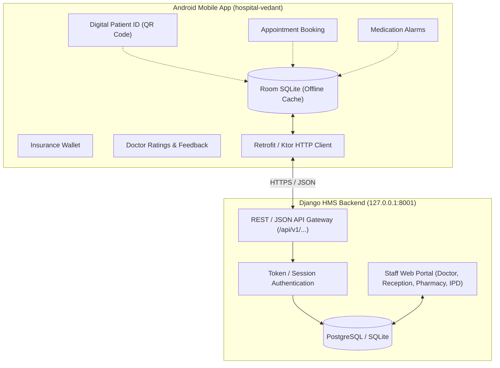

# Feature Audit & Integration Architecture: Android App (`hospital-vedant`) ⇄ Django HMS

## Overview
This document captures the feature inventory of the Android Jetpack Compose app ([`hospital-vedant`](https://github.com/abhishek-sahu-ai/hospital-vedant.git)) and maps out how each feature can be ported, integrated, or exposed via REST APIs in the Django Hospital Management System (`hospital-management-system`).

This architectural plan was formulated with input from local models (**DeepSeek-R1:7b** for edge-case reasoning and **Qwen2.5-Coder:7b** for technical mapping).

---

## 1. Feature Comparison & Porting Matrix

| # | Mobile App Feature (`hospital-vedant`) | Key Kotlin Source | Current Django HMS Status | Recommended Integration into Django & API Bridge |
|---|---|---|---|---|
| **1** | **Digital Patient ID & Fast-Track QR Pass** | `DigitalPatientIdScreen.kt`, `QrCodeGenerator.kt` | Patients have `mrn`, but no dynamic QR generator or instant scanner. | **High Value**: Expose `/api/v1/patients/<id>/qr/` returning `VEDANT_HOSPITAL_CHECKIN_V1:UHID=...;TOKEN=...`. Add optical webcam/barcode scanner modal to Reception web UI (`/appointments/create/`) for instant check-in. |
| **2** | **OPD Peak Hours Crowd Forecaster** | `OpdPeakHoursScreen.kt`, `OpdPeakHourChart.kt` | Stores `scheduled_at`, but no rush-hour analytics or queue congestion heatmaps. | **High Value**: Compute hourly appointment volume and expose `/api/v1/opd/peak-hours/`. Show congestion badges ("Low Rush", "Peak Hours") on both Web and Mobile appointment booking forms. |
| **3** | **Medication Reminders & Dosage Scheduler** | `MedicationReminderScreen.kt`, `MedicationEntity.kt` | Prescriptions store items (dosage, frequency, duration), but as static text for print. | **High Value**: Expose `/api/v1/prescriptions/active/` returning structured morning/noon/night timings. Android app syncs live e-Rx to trigger local alarms and push notifications. |
| **4** | **Insurance Card & ABHA Wallet** | `InsuranceCardsScreen.kt`, `InsuranceCardEntity.kt` | Unstructured `PatientDocument` only; no structured policy metadata. | **High Value**: Add structured fields to `Patient` (`abha_number`, `insurance_provider`, `policy_number`). Auto-apply insurance coverage during IPD admission advance deposit calculations. |
| **5** | **Doctor Ratings & Patient Feedback** | `PatientFeedbackScreen.kt`, `DoctorSatisfactionVisualizer.kt` | No patient review or feedback models exist in Django. | **Medium Value**: Create `PatientFeedback` model (1–5 stars, doctor rating, wait-time score). Expose `POST /api/v1/feedback/` and show satisfaction metrics on the Director/Staff dashboard. |
| **6** | **24x7 Emergency One-Tap Helpline** | `PersistentEmergencyHelplineCard.kt`, `EmergencyDialerDialog.kt` | Static contact text in public footer. | **Quick Win**: Add unified emergency bar (`+91 94150 12345 / 108`), direct WhatsApp triage, and ambulance dispatch on the public web portal. |

---

## 2. End-to-End System Architecture



---

## 3. High-Priority REST API Blueprint for Django HMS

### Endpoint 1: Digital Patient Check-in & QR
- **Route**: `GET /api/v1/patients/checkin-qr/` & `POST /api/v1/reception/scan-checkin/`
- **Payload Schema**:
  ```json
  {
    "qr_payload": "VEDANT_HOSPITAL_CHECKIN_V1:UHID=MRN-2026-0001;NAME=Aarav Sharma;TOKEN=RECEP-FAST-001"
  }
  ```
- **Action**: Instantly matches the patient record and marks appointment/reception queue status to `CHECKED_IN`.

### Endpoint 2: OPD Hourly Congestion & Slot Forecasting
- **Route**: `GET /api/v1/opd/congestion/`
- **Response**:
  ```json
  {
    "date": "2026-10-06",
    "hourly_trends": [
      { "hour": "09:00", "congestion": "LOW", "active_doctors": 4, "avg_wait_minutes": 10 },
      { "hour": "11:00", "congestion": "HIGH", "active_doctors": 6, "avg_wait_minutes": 35 },
      { "hour": "16:00", "congestion": "MODERATE", "active_doctors": 3, "avg_wait_minutes": 15 }
    ]
  }
  ```

### Endpoint 3: Active Patient Prescriptions (for Medication Alarms)
- **Route**: `GET /api/v1/patients/<uhid>/active-medications/`
- **Response**:
  ```json
  {
    "patient_uhid": "MRN-2026-0001",
    "medications": [
      {
        "name": "Paracetamol 650mg",
        "dosage": "1 tablet",
        "frequency": "TDS (Thrice a day)",
        "timings": ["08:00", "14:00", "20:00"],
        "meal_timing": "AFTER_FOOD",
        "duration_days": 5
      }
    ]
  }
  ```

### Endpoint 4: Patient Feedback & Doctor Ratings
- **Route**: `POST /api/v1/feedback/`
- **Request**:
  ```json
  {
    "appointment_id": 42,
    "rating": 5,
    "nps_score": 10,
    "wait_time_rating": 4,
    "doctor_id": "DOC-01",
    "comments": "Excellent care and minimal waiting time."
  }
  ```

---

## 4. Implementation Phasing

### Phase 1: Quick Wins & Data Harmonization (Current)
1. Mirror Vedant Hospital emergency numbers and departments across both codebases.
2. Ensure Patient MRN format aligns between Django (`MRN-YYYY-XXXX`) and Android (`UHID-VDH-XXXX`).

### Phase 2: Reception QR Scanner & Digital Passes
1. Add SVG/PNG QR generation to Django patient detail cards.
2. Implement reception camera scanner in web portal to read QR payloads generated by the Android app.

### Phase 3: REST API Bridge
1. Build lightweight Django JSON views for doctors, appointments, and active prescriptions.
2. Replace static Room SQLite initial data in `hospital-vedant/HospitalRepository.kt` with live Retrofit network calls.
